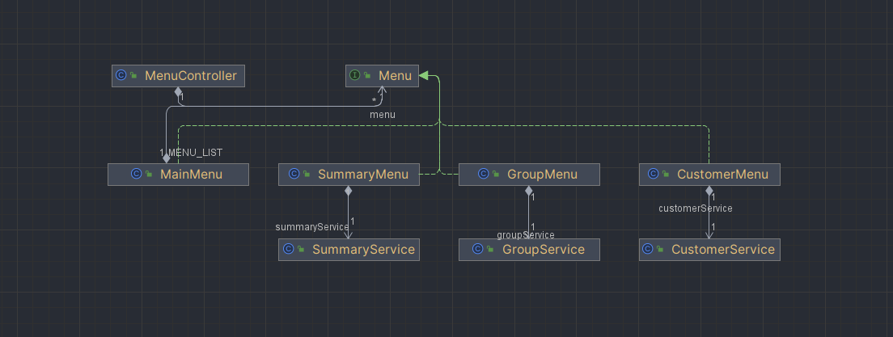

## 패스트캠퍼스 미니 프로젝트 - Smart Store

### Directory Structure

```java
==================================================
                   Smart Store 
==================================================
│   Main.java
│   SmartStore.java
│   
├───controller
│   │   MenuController.java
│   │   
│   └───menu
│           CustomerMenu.java
│           GroupMenu.java
│           MainMenu.java
│           Menu.java
│           SummaryMenu.java
│           
├───domain
│   ├───customer
│   │       Customer.java
│   │       Customers.java
│   │       
│   └───group
│           Group.java
│           Groups.java
│           GroupType.java
│           
├───exception
│       ArrayEmptyException.java
│       GroupNotFoundException.java
│       GroupSetAlreadyException.java
│       InputEmptyException.java
│       InputEndException.java
│       InputFormatException.java
│       InputRangeException.java
│       InputTypeException.java
│       
├───service
│       CustomerService.java
│       GroupService.java
│       SummaryService.java
│       
└───util
├  Console.java
│   
├───arrays
│   │   Collections.java
│   │   MyArray.java
│   │   
│   └───exception
│           ElementNotFoundException.java
│           EmptyArrayException.java
│           NullArgumentException.java
│           
└───view
    Input.java
    Message.java
    Output.java
```

- `controller`: MenuController (Main, Parameter, Customer, Summary)
- `domain`: DTO, Local Storage, Menu
- `exception`: Custom Exception
- `service`: Local Storage Access Service (Customers, Groups)
- `util.view`: Input, Output View

---
### ClassDiagram



---
### controller

- `MenuController`: 소유한 메뉴를 실행

### domain

customer

- `Customer`: 회원 DTO
- `Customers`: 회원 로컬 저장소

group

- `Group`: 그룹 DTO (회원 분류 기준)
- `Groups`: 그룹 로컬 저장소
- `GroupType`: 그룹 타입 (None, General, Vip, VVip)
- `Prarmeter`: 그룹 파라미터

menu

- `Menu`: 메뉴 인터페이스
- `MainMenu`: 각 서브 메뉴를 실행 (Customer, Group, Summary)
- `CustomerMenu`: CustomerService 기능 호출
- `GroupMenu`: GroupService 기능 호출
- `SummaryMenu`: SummaryService 기능 호출

### service

- `CustomerService`: 회원 로컬 저장소 CRUD 처리
- `GroupService`: 그룹 로컬 저장소 CRUD 처리
- `SummaryService`: 회원 정보 분류

### View

- `CustomerInput`: 사용자 메뉴 관련 View
- `GroupInput`:  그룹 메뉴 관련 View
- `MenuInput`: 메뉴 선택 관련 View

### exception

- `ArrayEmptyException`: 배열이 비어있는 경우
- `InputEmptyException`: 입력값이 비어있는 경우
- `InputEndException`: “end”가 입력된 경우
- `InputFormatException`: 올바르지 않은 형식의 입력값이 입력된 경우
- `InputRangeException`: 올바르지 않은 범위의 입력값이 입력된 경우
- `InputTypeException`: 올바르지 않은 타입의 입력값이 입력된 경우

### Util

- `Console`: Scanner 생성 및 close
---

### 프로젝트 요구사항

- [x]  분류기준
    - [x]  고객의 분류기준을 입력할 수 있다.
    - [x]  고객의 분류기준을 설정할 수 있다.
    - [x]  고객의 분류기준을 수정할 수 있다.
- [x]  고객정보
    - [x]  고객의 정보를 입력할 수 있다.
    - [x]  고객의 정보를 추가할 수 있다.
    - [x]  고객의 정보를 삭제할 수 있다.
- [x]  고객 분류기능
    - [x]  분류기준에 의해 고객을 분류할 수 있다.
    - [x]  분류기준에 의해 분류된 고객의 정보를 출력할 수 있다.
    - [x]  분류기준에 의해 분류된 고객의 정보를 이름순으로 정렬할 수 있다.
    - [x]  분류기준에 의해 분류된 고객의 정보를 총 이용시간 순으로 정렬할 수 있다.
    - [x]  분류기준에 의해 분류된 고객의 정보를 총 결제금액 순으로 정렬할 수 있다.
- [x]  예외처리
    - [x]  고객 분류 기준이 추가될 경우 수정된 분류기준에 의해 고객을 다시 고려할 수 있다.
    - [x]  고객 정보가 추가되거나 삭제될 경우의 시나리오도 생기는 예외도 고려할 수 있다.

